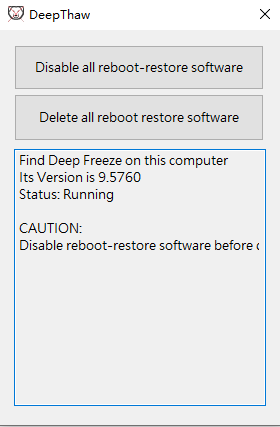

# DeepThaw

## Introduction
This is a small utility that can disable system reboot‑restore software (such as Deep Freeze, Reboot Restore, etc.) even when they are enabled and password‑protected.
  
Currently it only supports Deep Freeze (all versions) and Windows 10/11 64‑bit operating systems.
  
It uses a kernel‑mode driver to counter them, allowing it to bypass the reboot‑restore software regardless of its version.  
  
The method used by this tool can essentially defeat any system reboot‑restore software, regardless of how often they update, as long as they do not fundamentally change their underlying approach.  
  
## The Icon & UI
  

## Build Environment
Visual Studio 2026 + Windows 11 SDK 10.0.28000.2114 + WDK 28000.1761

## TO-DO list （No idea when I'll get these TODOs done – I'm pretty lazy, to be honest :）
1. Improve support for Windows 10 32‑bit.
2. Add support for Windows 7 (and even Windows XP).
3. Support Reboot Restore RX.
4. Support Shadow Defender.
5. Completely and unbreakably harden the stability of programs in complex environments using Intel VT-x and AMD-V technologies.