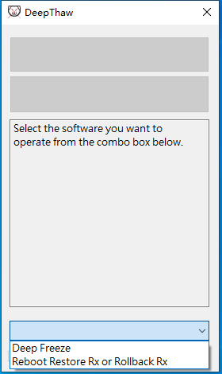
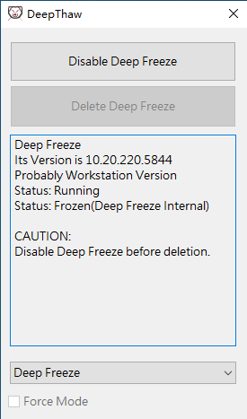
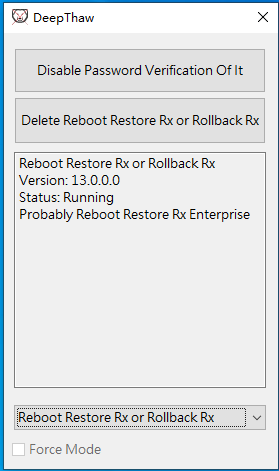

# DeepThaw

## Introduction
This is a small utility that can disable system Reboot-To-Restore software (such as Deep Freeze, Reboot Restore, etc.) even when they are enabled and password‑protected.
  
Now it can support    
Deep Freeze Standard            7.73.020.0000-9.0.020.5760
Deep Freeze Enterprise          8.32.220.0000-10.20.020.5844
Deep Freeze Server series       7.73.xxx.0000-9.0.xxx.5760              (The tool will directly recognize it as Deep Freeze Standard.)
    
Reboot Restore Rx Standard\Reboot Restore Rx Enterprise     0.0.0.0-13.0.0.0
Rollback Rx Professional                                    0.0.0.0-12.9.0.0
Rollback Rx Server                                          0.0.0.0-12.7.0.0

On Windows 7 64-bit and later systems

### Legal Disclaimer
This program is intended for learning and research purposes only. If you intend to use this tool on a real computer, you must have the right to control or manage that computer. The author of this tool shall not be held liable for any losses or consequences caused by its use for illegal purposes.

### Introduction to Deep Freeze
https://www.faronics.com/deep-freeze-on-cloud

### Introduction to Reboot Restore Rx(RollBack Rx)
https://horizondatasys.com/automated-pc-maintenance/
https://horizondatasys.com/disaster-recovery/

## The Icon & UI
  

## Build Environment
Visual Studio 2026 + Windows 11 SDK 10.0.28000.2114 + WDK 28000.1761

## TO-DO list （No idea when I'll get these TODOs done – I'm pretty lazy, to be honest :）
1. ~Improve support for Windows 10 32‑bit.~
2. ~Add support for Windows 7 (and even Windows XP).~
3. ~Support Reboot Restore RX.~
4. ~Support Shadow Defender.~  
5. ~Thoroughly harden "Force Mode" using EFI.~
6. ~Thoroughly resolve the utility's stability in complex environments by permitting I/O operations only from the Configuration Manager.~
7. ~Harden the stability of programs in complex environments using Intel VT-x and AMD-V technologies(If it is necessary).~
8. Improve Force Mode.
9. Improve the "Disable Password Verification of Reboot Restore Rx (Rollback Rx)" feature on Windows 7.(It currently only supports Windows 8 and later operating systems.)

